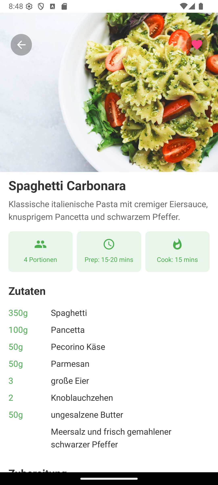

# Recipe Buddy

Recipe Buddy ist eine mobile Anwendung, die entwickelt wurde, um Nutzern das Entdecken, Verwalten und Kochen von Rezepten zu erleichtern. Mit einer personalisierten Benutzererfahrung bietet die App Funktionen wie Benutzerprofile, Lieblingsrezepte, Erinnerungen und detaillierte Rezeptanleitungen. Egal, ob du Anfänger oder erfahrener Koch bist – Recipe Buddy macht Kochen einfach und unterhaltsam.

## Inhaltsverzeichnis

- [Beschreibung](#beschreibung)
- [Funktionen](#funktionen)
- [Screenshots](#screenshots)
- [Nutzung](#nutzung)
- [Mitwirken](#mitwirken)
- [Lizenz](#lizenz)

## Beschreibung

Recipe Buddy ist dein perfekter Begleiter in der Küche. Mit einer benutzerfreundlichen Oberfläche kannst du neue Rezepte entdecken, deine Favoriten speichern, Erinnerungen für Kochaufgaben setzen und die App-Einstellungen an deine Vorlieben anpassen. Die Anwendung integriert externe APIs, um eine umfangreiche Rezeptdatenbank bereitzustellen, und sorgt mit Firebase-Authentifizierung für sicheres Datenmanagement.

## Funktionen

- **Benutzerauthentifizierung und Profilmanagement**: Sicher einloggen und dein persönliches Profil verwalten.
- **Personalisierte Begrüßungen und Empfehlungen**: Erhalte eine herzliche Begrüßung und Rezeptvorschläge, die auf dich zugeschnitten sind.
- **Rezeptsuche**: Durchstöbere eine Vielzahl von Rezepten mit Such- und Filteroptionen.
- **Lieblingsrezepte**: Speichere deine Lieblingsrezepte für schnellen Zugriff.
- **Erinnerungen**: Stelle Erinnerungen für Kochaufgaben oder neue Rezepte ein.
- **Detaillierte Rezeptansicht**: Zugriff auf umfassende Rezeptdetails, einschließlich Zutaten und Zubereitungszeiten.
- **Einstellungen**: Passe dein Erlebnis mit Optionen wie Dark Mode, Sprachauswahl und Speicherverwaltung an.
- **API-Integration**: Nutze externe APIs für Rezeptdaten und Benutzerauthentifizierung.

## Screenshots

Hier sind einige Screenshots, die die Hauptfunktionen von Recipe Buddy zeigen:

### 1. Login-Bildschirm

*Caption: Der Login-Bildschirm, auf dem Benutzer ihre Zugangsdaten eingeben oder sich registrieren können.*

### 2. Startbildschirm

*Caption: Der Startbildschirm mit personalisierter Begrüßung, Rezeptvorschlägen und Lieblingsrezepten.*

### 3. Rezeptliste

*Caption: Durchstöbere eine Vielzahl von Rezepten mit Bildern und Beschreibungen.*

### 4. Detaillierte Rezeptansicht

*Caption: Detaillierte Informationen zu einem Rezept, einschließlich Zutaten und Zubereitungszeiten.*

### 5. Einstellungsmenü

*Caption: Zugriff auf verschiedene Einstellungsoptionen wie Profilmanagement, Favoriten und Erinnerungen.*

### 6. Erinnerungen

*Caption: Setze und verwalte Erinnerungen für Kochaufgaben oder neue Rezepte.*

### 7. Speicherverwaltung

*Caption: Überwache und verwalte den Speicherbedarf der App und Firebase-Daten.*

### 8. API-Informationen

*Caption: Details zu den in der App verwendeten APIs für Rezeptdaten und Authentifizierung.*

### 9. Zusätzliche Einstellungen

*Caption: Passe dein App-Erlebnis mit Einstellungen wie Dark Mode und Sprachauswahl an.*

## Nutzung

Der Einstieg in Recipe Buddy ist einfach:

1. **Einloggen oder Registrieren**: Öffne die App und melde dich mit deinen Zugangsdaten an oder erstelle ein neues Konto.
2. **Rezepte entdecken**: Nutze die Suchleiste oder durchstöbere die Rezeptliste, um etwas zu finden, das dir gefällt.
3. **Favoriten speichern**: Tippe auf das Herzsymbol eines Rezepts, um es zu deinen Favoriten hinzuzufügen.
4. **Erinnerungen setzen**: Gehe zum Erinnerungs-Bereich, um Benachrichtigungen für Kochaufgaben einzurichten.
5. **Rezeptdetails ansehen**: Wähle ein Rezept aus, um detaillierte Anleitungen, Zutaten und Kochzeiten zu sehen.
6. **Einstellungen anpassen**: Passe deine App-Voreinstellungen im Einstellungsmenü an, z. B. Dark Mode oder Sprache.

## Mitwirken

Beiträge zu Recipe Buddy sind willkommen! Wenn du mitwirken möchtest, folge diesen Schritten:

1. Forke das Repository.
2. Erstelle einen neuen Branch für dein Feature oder deinen Bugfix.
3. Reiche einen Pull Request mit einer detaillierten Beschreibung deiner Änderungen ein.
